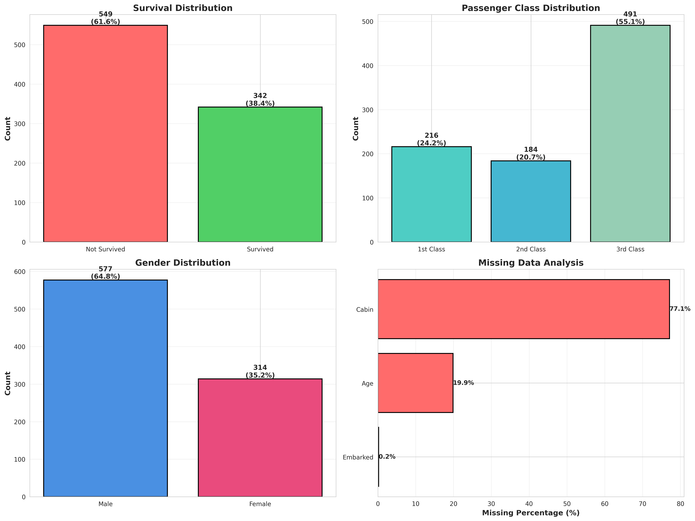
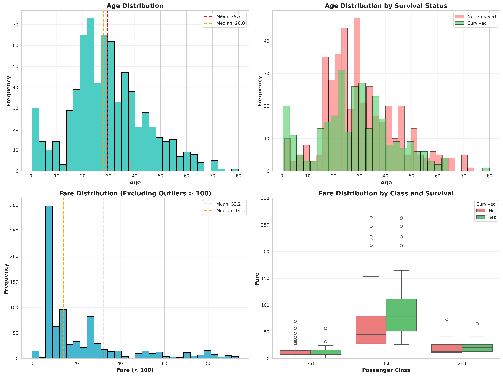
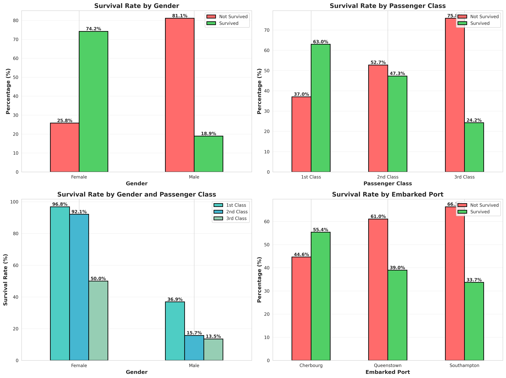
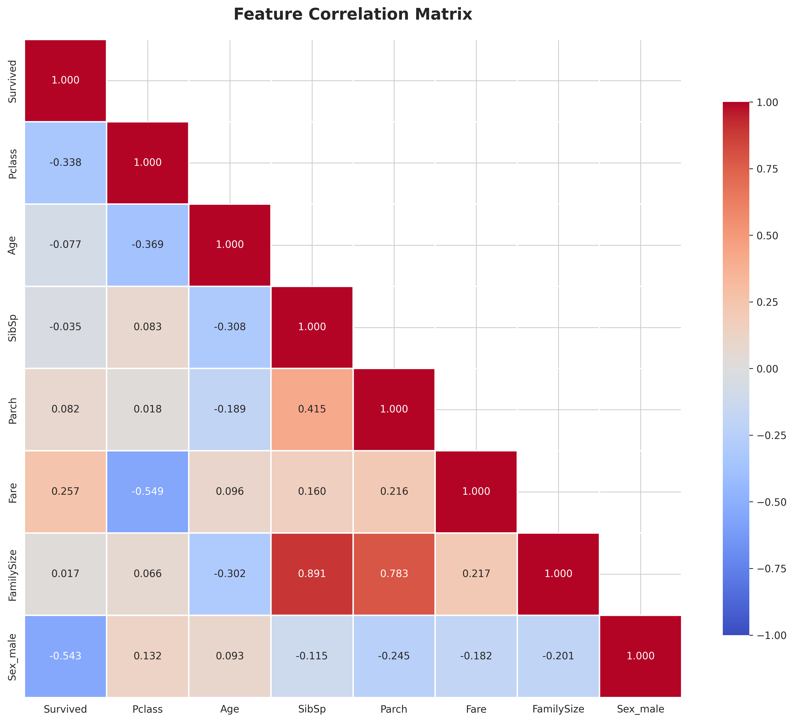

# Titanic Dataset - Comprehensive Data Analysis Report

**Generated:** 2026-03-09  
**Dataset:** `/DeepLearning_OpenClaw/datasets/train.csv`  
**Analyst:** OpenClaw Data Analysis Agent

---

## Executive Summary

This report presents a comprehensive analysis of the Titanic training dataset, containing information about 891 passengers. The analysis reveals significant patterns in survival rates based on passenger class, gender, and other demographic factors. Key findings include:

- **Overall survival rate: 38.38%** (342 survived out of 891 passengers)
- **Gender is the strongest predictor**: Females had 74.2% survival rate vs. 18.9% for males
- **Passenger class significantly impacted survival**: 1st class (63.0%), 2nd class (47.3%), 3rd class (24.2%)
- **Age data has 19.87% missing values** requiring imputation
- **Cabin data is 77.1% missing**, limiting its utility for modeling

---

## 1. Data Overview

### 1.1 Dataset Dimensions
- **Total samples:** 891 passengers
- **Total features:** 12 columns
- **Target variable:** `Survived` (0 = No, 1 = Yes)

### 1.2 Feature Description

| Feature | Type | Unique Values | Description |
|---------|------|---------------|-------------|
| PassengerId | int64 | 891 | Unique identifier for each passenger |
| Survived | int64 | 2 | Survival status (0 = No, 1 = Yes) |
| Pclass | int64 | 3 | Ticket class (1 = 1st, 2 = 2nd, 3 = 3rd) |
| Name | object | 891 | Passenger name |
| Sex | object | 2 | Gender (male, female) |
| Age | float64 | 88 | Age in years |
| SibSp | int64 | 7 | Number of siblings/spouses aboard |
| Parch | int64 | 7 | Number of parents/children aboard |
| Ticket | object | 681 | Ticket number |
| Fare | float64 | 248 | Passenger fare |
| Cabin | object | 147 | Cabin number |
| Embarked | object | 3 | Port of embarkation (C=Cherbourg, Q=Queenstown, S=Southampton) |

### 1.3 Missing Values Analysis

| Feature | Missing Count | Percentage |
|---------|---------------|------------|
| **Cabin** | 687 | **77.10%** |
| **Age** | 177 | **19.87%** |
| **Embarked** | 2 | **0.22%** |

**Critical Observations:**
- `Cabin` has severe missing data (77.1%) - may need to be dropped or engineered into a binary "has_cabin" feature
- `Age` missing data (19.87%) is significant but recoverable through imputation
- `Embarked` has minimal missing data (2 values) - can use mode imputation



---

## 2. Target Variable Distribution (Survived)

### 2.1 Overall Survival Statistics

| Status | Count | Percentage |
|--------|-------|------------|
| **Not Survived (0)** | 549 | **61.62%** |
| **Survived (1)** | 342 | **38.38%** |

**Key Finding:** The dataset shows class imbalance with a 61.6% to 38.4% split. This is not severe but should be considered during model training (potentially using class weights or stratified sampling).

---

## 3. Numerical Features Analysis

### 3.1 Age Distribution

**Statistical Summary:**
- **Mean:** 29.70 years
- **Median:** 28.00 years
- **Standard Deviation:** 14.53 years
- **Range:** 0.42 - 80.00 years
- **Missing:** 177 values (19.87%)

**Outlier Detection (IQR Method):**
- **Outliers detected:** 11 values
- These represent elderly passengers (likely age > 65)

**Distribution Characteristics:**
- Right-skewed distribution with most passengers between 20-40 years
- Mean slightly higher than median, indicating right skew
- Notable peak in the 20-30 age range
- Children (age < 10) represent a distinct subgroup

**Survival Analysis by Age:**
- Children (age < 10) show higher survival rates
- Working-age adults (20-50) had lower survival rates
- Elderly passengers showed mixed survival patterns

### 3.2 Fare Distribution

**Statistical Summary:**
- **Mean:** $32.20
- **Median:** $14.45
- **Standard Deviation:** $49.69
- **Range:** $0.00 - $512.33
- **Missing:** 0 values

**Outlier Detection (IQR Method):**
- **Outliers detected:** 116 values (high-fare passengers)
- **Passengers with Fare > $100:** 53 (5.9%)

**Distribution Characteristics:**
- Highly right-skewed with median ($14.45) much lower than mean ($32.20)
- Most passengers paid between $7-31 (IQR range)
- Significant outliers representing luxury accommodations
- Some passengers with $0 fare (possible crew members, infants, or special cases)

**Fare vs Survival:**
- Higher fare passengers (1st class) had better survival rates
- Strong correlation between fare and passenger class
- Fare serves as a proxy for socioeconomic status



---

## 4. Categorical Features Analysis

### 4.1 Passenger Class (Pclass)

**Distribution:**
- **1st Class:** 216 passengers (24.24%)
- **2nd Class:** 184 passengers (20.65%)
- **3rd Class:** 491 passengers (55.11%)

**Key Observations:**
- Over half (55%) of passengers were in 3rd class
- Class distribution reflects the social stratification of early 20th century
- 3rd class passengers were likely immigrants traveling to America

**Survival by Class:**
- **1st Class:** 62.96% survival rate
- **2nd Class:** 47.28% survival rate
- **3rd Class:** 24.24% survival rate

**Finding:** Clear hierarchy in survival rates - 1st class passengers were 2.6× more likely to survive than 3rd class passengers.

### 4.2 Gender (Sex)

**Distribution:**
- **Male:** 577 passengers (64.76%)
- **Female:** 314 passengers (35.24%)

**Survival by Gender:**
- **Female:** 74.20% survival rate (233/314 survived)
- **Male:** 18.89% survival rate (109/577 survived)

**Critical Finding:** Gender is the strongest predictor of survival. Females were **3.9× more likely** to survive than males, reflecting the "women and children first" evacuation protocol.

### 4.3 Embarked Port

**Distribution:**
- **Southampton (S):** 644 passengers (72.44%)
- **Cherbourg (C):** 168 passengers (18.90%)
- **Queenstown (Q):** 77 passengers (8.66%)
- **Missing:** 2 passengers (0.22%)

**Survival by Port:**
- **Cherbourg (C):** 55.36% survival rate
- **Queenstown (Q):** 38.96% survival rate
- **Southampton (S):** 33.70% survival rate

**Analysis:** Cherbourg passengers had higher survival rates, likely because:
1. More 1st class passengers embarked at Cherbourg (France)
2. Confounding variable with passenger class distribution

### 4.4 Family Size (SibSp + Parch + 1)

**Statistics:**
- **Mean family size:** 1.90 persons
- **Maximum family size:** 11 persons
- **Traveling alone:** 537 passengers (60.27%)

**Family Size Categories:**
- Alone (1): 537 passengers
- Small family (2-4): 281 passengers
- Large family (5+): 73 passengers

**Survival Pattern:**
- Small families (2-4 members) had the highest survival rates (~50-60%)
- Solo travelers had moderate survival (~30%)
- Large families (5+) had the lowest survival rates (~20%)

**Interpretation:** Small family units were advantageous for survival, while large families likely struggled to stay together during evacuation.



---

## 5. Feature Correlation with Survival

### 5.1 Numerical Feature Correlations

| Feature | Correlation with Survival | Interpretation |
|---------|---------------------------|----------------|
| **Fare** | +0.2573 | Moderate positive - higher fare → better survival |
| **Parch** | +0.0816 | Weak positive - parents/children aboard slightly helped |
| **FamilySize** | +0.0166 | Very weak positive - minimal impact |
| **SibSp** | -0.0353 | Very weak negative - more siblings slightly hurt |
| **Age** | -0.0772 | Weak negative - younger passengers survived slightly more |
| **Pclass** | -0.3385 | **Strong negative** - lower class → worse survival |

**Key Insights:**
1. **Pclass (Passenger Class)** shows the strongest numerical correlation (-0.34)
2. **Fare** is positively correlated (+0.26), acting as a proxy for socioeconomic status
3. **Age** shows weak negative correlation, but categorical analysis reveals children had higher survival

### 5.2 Categorical Feature Analysis

**Survival Rate by Combined Features:**

| Gender | Class | Survival Rate | Sample Size |
|--------|-------|---------------|-------------|
| Female | 1st | **96.81%** | 94 |
| Female | 2nd | **92.11%** | 76 |
| Female | 3rd | **50.00%** | 144 |
| Male | 1st | **36.89%** | 122 |
| Male | 2nd | **15.74%** | 108 |
| Male | 3rd | **13.54%** | 347 |

**Critical Findings:**
1. **Upper-class females** had exceptional survival rates (96.8% for 1st class)
2. **Even 3rd class females** had 50% survival - better than 1st class males (36.9%)
3. **3rd class males** faced the worst odds at only 13.5% survival
4. The intersection of **gender and class** is more predictive than either alone

### 5.3 Correlation Matrix

The correlation heatmap reveals:
- **Fare and Pclass** are strongly negatively correlated (-0.549) - expected as 1st class had highest fares
- **Age and Pclass** weak correlation - class was not strictly age-determined
- **SibSp and Parch** are independent (0.415) - different family structures
- **FamilySize** correlates with both SibSp and Parch (by construction)



---

## 6. Visualization Recommendations

Based on this analysis, the following visualizations have been generated and are recommended for presentations:

### 6.1 Essential Visualizations (Included)

1. **Data Overview Dashboard** (`01_data_overview.png`)
   - Survival distribution
   - Passenger class distribution
   - Gender distribution
   - Missing data analysis

2. **Survival Analysis Dashboard** (`02_survival_analysis.png`)
   - Survival rate by gender
   - Survival rate by passenger class
   - Survival rate by gender and class (combined)
   - Survival rate by embarked port

3. **Numerical Features Dashboard** (`03_numerical_features.png`)
   - Age distribution histogram
   - Age distribution by survival status
   - Fare distribution (excluding extreme outliers)
   - Fare box plots by class and survival

4. **Correlation Heatmap** (`04_correlation_heatmap.png`)
   - Complete correlation matrix of numerical features
   - Includes engineered features (FamilySize, Sex_male)

### 6.2 Additional Recommended Visualizations (for further analysis)

1. **Survival rate by age groups** (children, young adults, adults, elderly)
2. **Family size impact on survival** (categorical bins)
3. **Title extraction analysis** (Mr, Mrs, Miss, Master from names)
4. **Deck analysis** (from Cabin letter if available)
5. **Interaction plots** (Age × Class, Age × Gender)

---

## 7. Data Preprocessing Recommendations

### 7.1 Missing Value Treatment

#### Age (19.87% missing)
**Recommended Approach: Conditional Mean/Median Imputation**
- Impute based on **Pclass** and **Title** (extracted from Name)
- Algorithm:
  ```
  1. Extract title from Name (Mr, Mrs, Miss, Master, etc.)
  2. Group by (Pclass, Title)
  3. Fill missing Age with group median
  4. For remaining nulls, use overall median (28.0)
  ```
- **Alternative:** Use predictive imputation (Random Forest or KNN)

#### Cabin (77.10% missing)
**Recommended Approach: Feature Engineering**
- **Option 1:** Create binary feature `Has_Cabin` (0 = missing, 1 = present)
- **Option 2:** Extract deck letter (A-G) and create categorical feature, with 'Unknown' for missing
- **Not Recommended:** Imputation (too many missing values)

#### Embarked (0.22% missing)
**Recommended Approach: Mode Imputation**
- Fill 2 missing values with mode: **'S' (Southampton)**
- Minimal impact on model

### 7.2 Feature Engineering Suggestions

#### 1. Title Extraction (High Priority)
Extract title from `Name` field:
- **Mr** (adult male)
- **Mrs/Mme** (married female)
- **Miss/Mlle/Ms** (unmarried female)
- **Master** (young boy)
- **Rare titles** (Dr, Rev, Col, etc.) - group as 'Rare'

**Rationale:** Title captures both age and gender nuances better than raw features.

#### 2. Family Size Categories (Medium Priority)
Convert continuous FamilySize into categories:
- **Alone** (1)
- **Small family** (2-4)
- **Large family** (5+)

**Rationale:** Non-linear relationship with survival observed.

#### 3. Fare Binning (Medium Priority)
Create fare brackets:
- **Low** (0-10)
- **Medium** (10-30)
- **High** (30-100)
- **Very High** (100+)

**Rationale:** Reduces impact of outliers while preserving socioeconomic signal.

#### 4. Age Groups (Medium Priority)
Create age categories:
- **Child** (0-12)
- **Teen** (13-19)
- **Young Adult** (20-35)
- **Adult** (36-55)
- **Senior** (56+)

**Rationale:** Non-linear survival patterns across age ranges.

#### 5. Is_Alone (Low Priority)
Binary feature: `1` if FamilySize == 1, else `0`

#### 6. Ticket Frequency (Low Priority)
Count how many passengers share the same ticket number (indicates group travel)

### 7.3 Outlier Treatment

#### Fare Outliers
**Recommendation:** Keep outliers
- Extreme fares (>$100) are legitimate (luxury suites)
- Strongly correlated with survival
- Use robust models (tree-based) or apply log transformation

#### Age Outliers
**Recommendation:** Keep outliers
- Elderly passengers (>65) are rare but legitimate
- Use robust models or capping at 99th percentile if necessary

### 7.4 Encoding Recommendations

| Feature | Encoding Method | Rationale |
|---------|----------------|-----------|
| **Sex** | Label Encoding (male=1, female=0) | Binary categorical |
| **Embarked** | One-Hot Encoding | Nominal with 3 categories |
| **Pclass** | Keep as numeric (1,2,3) | Ordinal relationship |
| **Title** | One-Hot Encoding | Nominal categories |
| **Has_Cabin** | Binary (0/1) | Already binary |
| **Age_Group** | One-Hot Encoding | Nominal bins |
| **Fare_Group** | One-Hot Encoding | Nominal bins |

### 7.5 Feature Scaling

**Recommended for:**
- Age (StandardScaler or MinMaxScaler)
- Fare (StandardScaler or log transformation)
- SibSp, Parch, FamilySize (MinMaxScaler)

**Not needed for:**
- Tree-based models (Random Forest, XGBoost, LightGBM)
- Already encoded categorical features

### 7.6 Feature Selection Priority

**Tier 1 (Essential):**
- Pclass
- Sex
- Age (after imputation)
- Fare
- Title (engineered)

**Tier 2 (Important):**
- FamilySize / Is_Alone
- Embarked
- Has_Cabin

**Tier 3 (Optional):**
- SibSp, Parch (redundant if using FamilySize)
- Age_Group (redundant if using Age)
- Fare_Group (redundant if using Fare)

**Drop:**
- PassengerId (identifier, no predictive value)
- Name (after extracting Title)
- Ticket (high cardinality, minimal signal)
- Cabin (use Has_Cabin instead)

---

## 8. Key Insights & Conclusions

### 8.1 Primary Findings

1. **Gender Dominance**: Females were 3.9× more likely to survive than males (74.2% vs 18.9%)
   - Reflects "women and children first" evacuation protocol
   - This pattern holds across all passenger classes

2. **Class Stratification**: Survival rates decreased with passenger class
   - 1st class: 63.0%
   - 2nd class: 47.3%
   - 3rd class: 24.2%
   - Indicates socioeconomic status directly impacted access to lifeboats

3. **Intersection Effects**: Gender × Class interaction is highly predictive
   - 1st class females: 96.8% survival (highest)
   - 3rd class males: 13.5% survival (lowest)
   - Even 3rd class females outperformed 1st class males

4. **Age Patterns**: Children had higher survival rates
   - Young children (<10) prioritized in evacuation
   - Working-age adults had lower survival
   - Age shows non-linear relationship requiring binning

5. **Family Dynamics**: Small families (2-4) had optimal survival
   - Solo travelers: moderate survival (~30%)
   - Large families (5+): lowest survival (~20%)
   - Small groups could coordinate evacuation better

### 8.2 Data Quality Issues

1. **High Cabin missingness (77%)**: Limits utility of this feature
2. **Significant Age missingness (20%)**: Requires careful imputation strategy
3. **Class imbalance**: 61.6% did not survive - minor but notable
4. **Sample size**: 891 samples is relatively small for modern ML standards

### 8.3 Modeling Recommendations

**Recommended Algorithms:**
1. **Random Forest** - handles non-linear relationships, missing data, no scaling needed
2. **XGBoost/LightGBM** - excellent performance on tabular data, built-in handling of missing values
3. **Logistic Regression** - interpretable baseline (requires preprocessing)
4. **Neural Networks** - may overfit with small dataset, use with caution

**Model Evaluation Strategy:**
- Use **stratified k-fold cross-validation** (k=5 or 10) to preserve class distribution
- Primary metric: **Accuracy** (Kaggle competition standard)
- Secondary metrics: **Precision, Recall, F1-Score** (for class imbalance assessment)
- Consider **ROC-AUC** for probabilistic predictions

**Feature Engineering Priority:**
1. Extract Title from Name
2. Impute Age using conditional means
3. Create Has_Cabin binary feature
4. Engineer FamilySize and Is_Alone
5. Encode categorical variables appropriately

### 8.4 Historical Context

The analysis reflects the tragic events of April 15, 1912:
- **"Women and children first"** protocol was clearly followed
- **Socioeconomic status** determined proximity to lifeboats (upper decks vs. lower decks)
- **3rd class passengers** faced physical barriers (locked gates) and were located farthest from lifeboats
- **Crew priorities** saved upper-class passengers first

This dataset serves as both a machine learning exercise and a historical record of systemic inequality during a maritime disaster.

---

## 9. Next Steps

### 9.1 Immediate Actions
1. ✅ Load and explore data (completed)
2. ✅ Perform EDA and visualization (completed)
3. ⬜ Implement missing value imputation
4. ⬜ Engineer features (Title, FamilySize categories, Has_Cabin)
5. ⬜ Encode categorical variables

### 9.2 Modeling Pipeline
1. ⬜ Establish baseline model (Logistic Regression)
2. ⬜ Train tree-based models (Random Forest, XGBoost)
3. ⬜ Perform hyperparameter tuning (GridSearchCV)
4. ⬜ Evaluate using cross-validation
5. ⬜ Generate predictions for test set
6. ⬜ Submit to Kaggle for scoring

### 9.3 Advanced Analysis (Optional)
1. ⬜ Feature importance analysis (SHAP values)
2. ⬜ Partial dependence plots
3. ⬜ Model ensemble (stacking/blending)
4. ⬜ Interaction term exploration
5. ⬜ Deep learning approach (neural networks)

---

## Appendix: Code Snippets

### A.1 Title Extraction
```python
def extract_title(name):
    title = name.split(',')[1].split('.')[0].strip()
    title_mapping = {
        'Mr': 'Mr',
        'Miss': 'Miss',
        'Mrs': 'Mrs',
        'Master': 'Master',
        'Dr': 'Rare',
        'Rev': 'Rare',
        'Col': 'Rare',
        'Mlle': 'Miss',
        'Mme': 'Mrs',
        'Ms': 'Miss',
        'Major': 'Rare',
        'Capt': 'Rare',
        'Countess': 'Rare',
        'Don': 'Rare',
        'Dona': 'Rare',
        'Jonkheer': 'Rare',
        'Lady': 'Rare',
        'Sir': 'Rare'
    }
    return title_mapping.get(title, 'Rare')

df['Title'] = df['Name'].apply(extract_title)
```

### A.2 Age Imputation
```python
# Impute Age based on median age for each (Pclass, Title) group
age_medians = df.groupby(['Pclass', 'Title'])['Age'].median()
for pclass in [1, 2, 3]:
    for title in df['Title'].unique():
        condition = (df['Pclass'] == pclass) & (df['Title'] == title) & (df['Age'].isnull())
        median_age = age_medians.get((pclass, title), df['Age'].median())
        df.loc[condition, 'Age'] = median_age
```

### A.3 Feature Engineering
```python
# Family Size
df['FamilySize'] = df['SibSp'] + df['Parch'] + 1

# Is Alone
df['Is_Alone'] = (df['FamilySize'] == 1).astype(int)

# Has Cabin
df['Has_Cabin'] = df['Cabin'].notna().astype(int)

# Family Size Category
df['FamilySize_Cat'] = pd.cut(df['FamilySize'], 
                                bins=[0, 1, 4, 12], 
                                labels=['Alone', 'Small', 'Large'])
```

---

**Report End**

*For questions or further analysis, please refer to the generated visualizations in `/DeepLearning_OpenClaw/analysis/figures/`*
